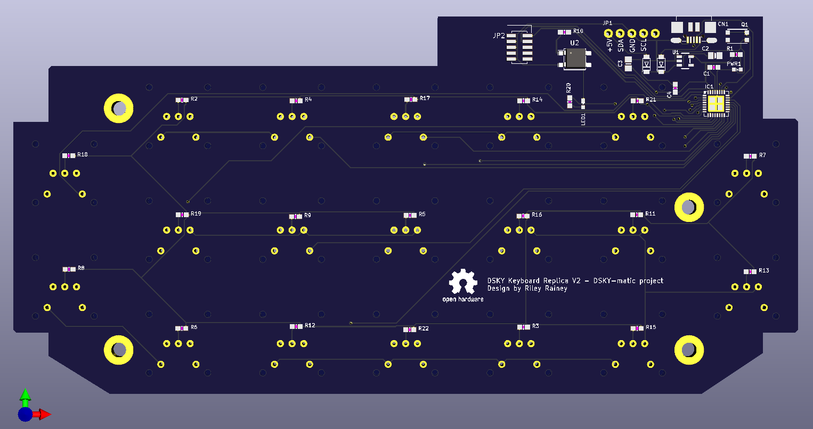

# DSKY Keyboard Replica

## *This project is a work in progress -- reuse at your own risk*

This is a scale functional replica of the keyboard for the Apollo Guidance Computer. It is implemented
using modern components. The hardware in this project is
designed to be part of a larger replica of the Display and Keyboard (DSKY) module of the AGC.

This keyboard is design to be capable of communicating to a controlling computer (a Raspberry Pi 3 or 4 in my case) via either
a USB or I2C communications interface. The board is controlled by a ATSAMD21 processor. The key switches include
green backlighting LEDs, which are controlled by the ATSAMD processor.

This project is composed of these component subfolders:

* pcb - KiCad project for the controller PCB design

* firmware - circuitpython board definition and python-based test and controller firmware

* hardware - 3D-printable frame components designed using Fusion 360. STEP and Fusion source files available. Hardware models used in thie replica were derived from models found in the [AGC Mechanical CAD project](https://github.com/rrainey/agc-mechanical-cad).

## Interfaces

* USB 2.0 Micro-B port
* I2C connection via header pins
* J-LINK-compatible JTAG debugging interface (10-pin header)

## Power Requirements

* +5VDC @ 400ma from either the Micro-B USB connector or a separate +5V header pin

## Credits and Related Projects

This project is inspired by work by Ben Krasnow creating a DSKY Electroluminescent Panel replica. You'll
find information about that project in [this Applied Science video](https://www.youtube.com/watch?v=Z2o_Sp2-aBo) by Ben. Like Ben's E/L display, this project is driven by an AT SAMD21 microcontroller chip; the same chip is used in the multiple Adafruit microcontroller boards, including the Adafruit Trinket M0.

## DSKY Keyboard Replica License

Creative Commons Attribution/Share-Alike, all text above must be included in any redistribution. See license.txt for additional details.

## Adafruit Trinket M0 License

This project includes hardware design elements from the Adafruit [Trinket M0 PCB project](https://github.com/adafruit/Adafruit-Trinket-M0-PCB). Adafruit invests time and resources providing this open source design, please support Adafruit and open-source hardware by purchasing products from [Adafruit](https://www.adafruit.com)!

The Trinket M0 was designed by Limor Fried/Ladyada for Adafruit Industries.

Creative Commons Attribution/Share-Alike, all text above must be included in any redistribution. See license.txt for additional details.

## My Background

My name is Riley Rainey. I'm a software developer by profession. I spent a number of years building aerospace simulations as my day job.

## Getting Support

There's no official support available, but you can [leave comments or create an issue](https://github.com/rrainey/DSKY-keyboard-replica/issues) in this GitHub project.

  
This work is licensed under a [Creative Commons Attribution-ShareAlike 4.0 International License](http://creativecommons.org/licenses/by-sa/4.0/).
